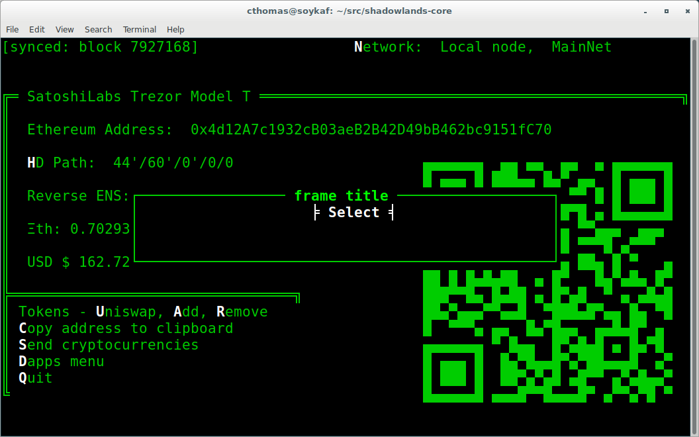
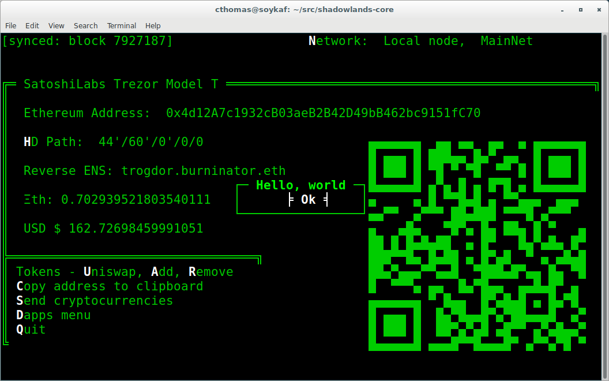
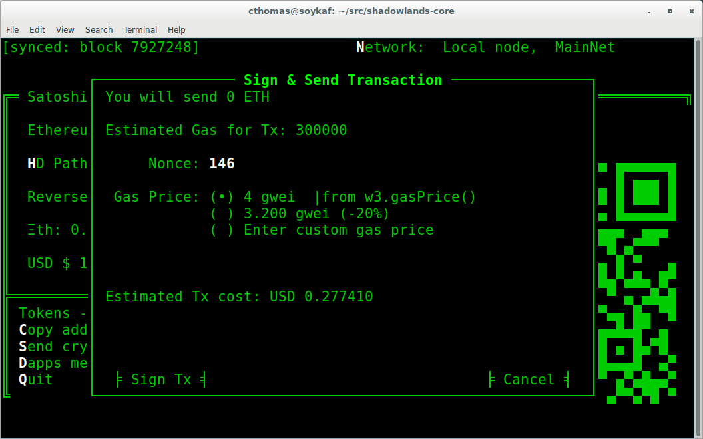
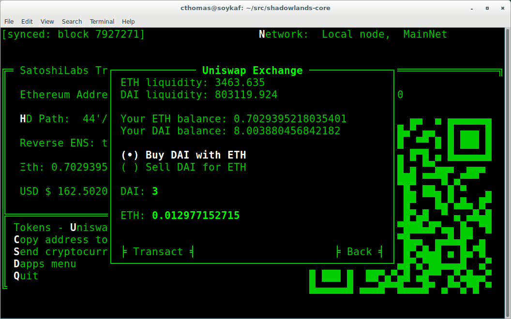
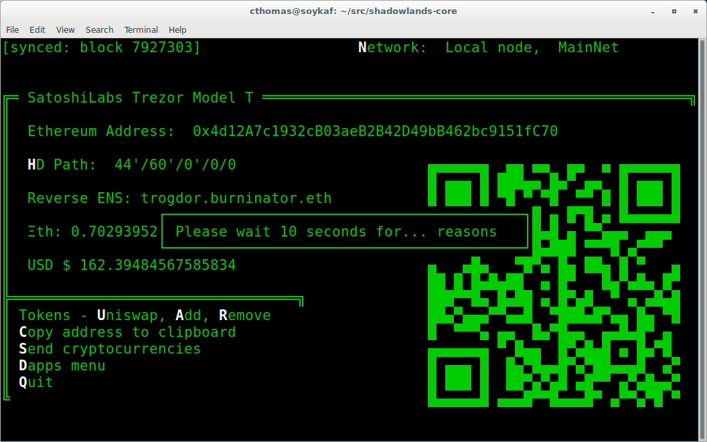

SLDapp
===========

.. py:class:: SLDapp

Abstract
--------

:class:`SLDapp` is the class which defines a Shadowlands Dapp.  It provides 
many useful properties and methods to make writing dapps easier.

See the :ref:`Tutorial` to get started quickly.

.. code-block:: python
        :caption: Example

        from shadowlands.sl_dapp import SLDapp

        class Dapp(SLDapp):
            def initialize(self):
                self.add_message_dialog("Hello world!")

Properties
----------

.. py:attribute:: SLDapp.w3

    Read-only property.
    A web3 object as provided by `the web3.py framework.
    <https://web3py.readthedocs.io/en/stable/web3.main.html#web3.Web3>`_

.. py:attribute:: SLDapp.node 

    Read-only property.
    An instance of :class:`Node`.

    .. code-block:: python

        # Find your address
        my_address = self.node.credstick.address

.. py:attribute:: SLDapp.config_key

    A string to use as a key for storing config properties.  Defaults to the name of your dapp module.

    Feel free to change this to something very unique at the top of your :func:`initialize` method.

.. py:attribute:: SLDapp.config_properties

    Read-only property.
    A persistent dictionary of properties specific to your dapp.
    To load a single property, use :class:`SLDapp.load_config_property`.

Methods
-------

.. py:method:: SLDapp.initialize()

    An abstract callback that you must implement.  It will fire upon the initialization of the SLDapp object.  
    Do your setup here and add SLFrames or other dialogs.

.. py:method:: SLDapp.new_block_callback()

    An optional callback that you may implement.  It will be fired when new blocks appear.

.. py:method:: SLDapp.add_sl_frame(sl_frame)
  
    Display a custom frame. Takes an instantiated subclass of :class:`SLFrame` as the sole argument.

.. code-block:: python
        
        from shadowlands.sl_dapp import SLDapp
        from shadowlands.sl_frame import SLFrame

        class Dapp(SLDapp):
            def initialize(self):
                myframe = MyFrame(self, 5, 50, title="frame title")
                self.add_sl_frame(myframe)

        class MyFrame(SLFrame):
            def initialize(self):
                self.add_button(self.close, "Select")

.. py:method:: SLDapp.add_message_dialog(message, **kwargs)

    Display a message dialog with the string supplied by ``message``.  You may pass in kwargs 
    which apply to ``asciimatics.Frame``.

.. code-block:: python

        from shadowlands.sl_dapp import SLDapp
        from shadowlands.sl_frame import SLFrame

        class Dapp(SLDapp):
            def initialize(self):
                self.add_message_dialog("Hello, world")

.. py:method:: SLDapp.add_transaction_dialog(tx_fn, tx_value=0, gas_limit=300000, title="Sign & Send Transaction", destroy_window=None, **kwargs)

    Display a transaction dialog, which allows the user to select gas price and gives a gas cost 
    estimate.  
    
    You must pass in a transaction function to ``tx_fn`` as the first argument. Instances of :class:`Erc20` have many build-in methods which return transaction functions.  You can also access the underlying function generators of any :class:`SLContract` instance with :func:`SLContract.functions`.
    
    You can provide a ``tx_value`` -  Decimal value denominated in Ether. 

    You may pass in an integer ``gas_limit``, which defaults to 300000.  It is best practice to always set this.

    A string ``title`` can be set.

    If there is a frame which needs to be programmatically destroyed upon the exit of the 
    transaction dialog, pass the object into ``destroy_window``. 

    You may pass in kwargs which apply to ``asciimatics.Frame``.

.. code-block:: python
    :caption: Example

        from shadowlands.sl_dapp import SLDapp
        from shadowlands.sl_frame import SLFrame
        from shadowlands.sl_contract.erc20 import Erc20

        class Dapp(SLDapp):
            def initialize(self):
                token = Erc20(
                    self.node, 
                    address='0x89d24A6b4CcB1B6fAA2625fE562bDD9a23260359'
                )
                tx_fn = token.transfer(
                    self.node.credstick.address, 1 * (10 ** token.decimals())
                )
                # we send ourselves 1.0 token
                self.add_transaction_dialog(tx_fn) 

.. py:method:: SLDapp.add_uniswap_frame(ec20_address, action='buy', buy_amount='', sell_amount='')

        Adds a Uniswap dialog if there exists a Uniswap exchange for the Erc20 token which resides at `erc20_address`.

        If no Exchange exists, a dialog will be displayed, informing the user of this.

.. code-block:: python
    :caption: Example

        from shadowlands.sl_dapp import SLDapp
        from shadowlands.sl_frame import SLFrame

        class Dapp(SLDapp):
            def initialize(self):
                address='0x89d24A6b4CcB1B6fAA2625fE562bDD9a23260359'
                self.add_uniswap_frame(address, buy_amount='3') 

.. py:method:: SLDapp.show_wait_frame(message)

    Display a wait message frame with string `message`.

    Use in case you have a thread doing work which will take time.
    Call this right *before* you start your new thread.
    The user will not be able to remove this frame; it needs to be programmatically removed by 
    calling :func:`SLDapp.hide_wait_frame`

.. code-block:: python
    :caption: Example

        from shadowlands.sl_dapp import SLDapp
        from shadowlands.sl_frame import SLFrame
        import threading
        from time import sleep

        class Dapp(SLDapp):
            def initialize(self):
                self.show_wait_frame("Please wait 10 seconds for... reasons")
                threading.Thread(target=self._my_thread).start()

            def _my_thread(self):
                sleep(10)
                self.hide_wait_frame()

        
.. py:method:: SLDapp.hide_wait_frame()

    Remove the wait message frame.  If it is not currently displayed, this method is a no-op.

    This should be called inside your new thread, as the last thing it does.

.. py:method:: SLDapp.save_config_property(property_key, value)

    Save a serializable object to the persistent data store.

.. py:method:: SLDapp.load_config_property(property_key, value)

    Load a serializable object from the persistent data store.

