SLFrame
===========

.. py:class:: SLFrame

Abstract
--------

:class:`SLFrame` provides a 'window' for interacting with users in your :class:`SLDapp`.  Create a 
subclass of :class:`SLFrame` and then add Widgets_ to it in the :func:`initialize`` method.

    .. code-block:: python
        :caption: Example

        from shadowlands.sl_dapp import SLDapp
        from shadowlands.sl_frame import SLFrame

        class Dapp(SLDapp):
            def initialize(self):
                self.add_sl_frame(
                    MyFrame(self, 5, 20)
                )

        class MyFrame(SLFrame):
            def initialize(self):
                self.add_button(self.close,"Push Me")

Constructor
-----------

.. py:method:: SLFrame.__init__(dapp, height, width, title=None)

The constructor's first argument should be an instance of :class:`SLDapp`.  `height` and `width` parameters are also required.  An optional `title` string will be displayed at the top of the frame.

    .. code-block:: python
        :caption: Example

        MyFrame(self.dapp, 5, 20, title="frame title")

.. image:: slframe-constructor.png
  :width: 800
  :alt: Dapps Menu

Properties
----------

.. py:attribute:: SLFrame.dapp

    The instance of :class:`SLDapp` which the :class:`SLFrame` belongs to.

Methods
-------

.. py:method:: SLFrame.initialize()

    An abstract callback that you must implement.  It will fire upon the initialization of the object.  
    Do your setup here and add widgets. 

.. py:method:: SLFrame.close()

Call to close the current frame.  In your dapp, be sure to open a new frame or dialog before calling :func:`close` on the current one.

.. _Widgets:

Widgets
-------

* :func:`SLFrame.add_button` 
* :func:`SLFrame.add_button_row` 
* :func:`SLFrame.add_checkbox` 
* :func:`SLFrame.add_qrcode` 
* :func:`SLFrame.add_textbox` 
* :func:`SLFrame.add_divider` 
* :func:`SLFrame.add_radiobuttons` 
* :func:`SLFrame.add_listbox` 
* :func:`SLFrame.add_label` 
* :func:`SLFrame.add_label_row` 
* :func:`SLFrame.add_label_with_button` 
* :func:`SLFrame.add_file_browser` 

.. py:method:: SLFrame.add_button(fn, text, layout=[100], layout_index=0, add_divider=True)

    Add a single button to your SLFrame.  ``fn`` is a function to run (lambdas are
    useful for this) when the button is pressed.  You can place a string within the
    button by setting ``text``.  The optional ``layout`` and ``layout_index``
    variables follow the ``asciimatics`` widget layout rules (see AsciimaticsLayout_ docs for details)

.. code-block:: python
        :caption: Example

        class MyFrame(SLFrame):
            def initialize(self):
                self.add_button(self.close,"Push Me")

 
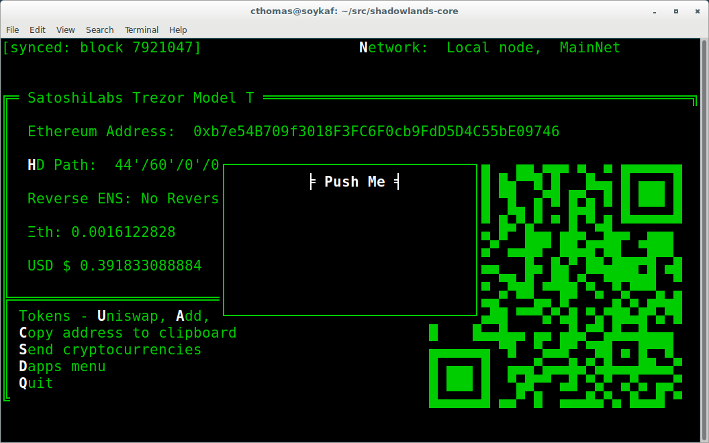

.. py:method:: SLFrame.add_button_row(buttons, layout=[1, 1, 1, 1], add_divider=True)

A row of buttons.  The argument ``buttons`` is an array of ``(string, function, index)`` tuples.  ``layout`` is an AsciimaticsLayout_ array, which defines the indices available for the buttons.

        .. code-block:: python
                :caption: Example
 
                class MyFrame(SLFrame):
                    def initialize(self):
                        my_buttons = [
                            ("Say hello", self.say_hi, 0),
                            ("Say bye", self.say_bye, 2),
                            ("Close", self.close, 3)
                        ]
                        self.add_button_row(my_buttons)

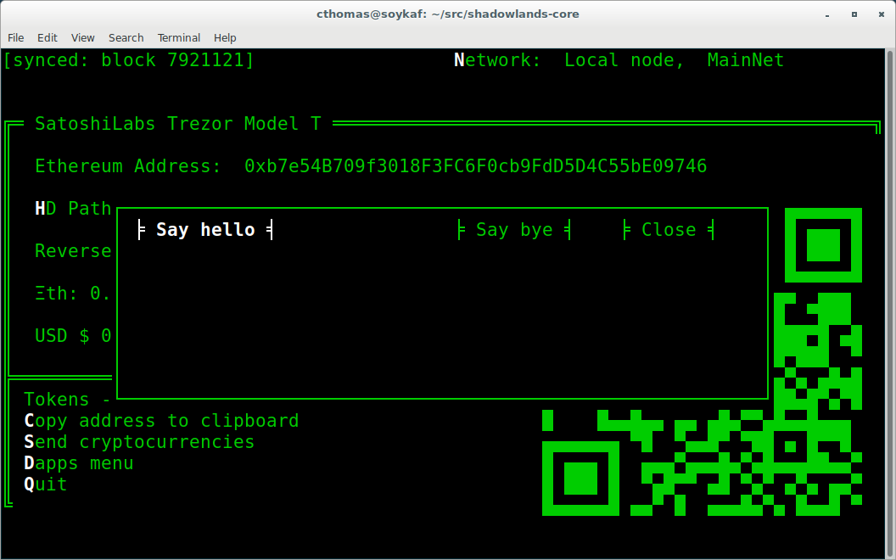

.. py:method:: SLFrame.add_checkbox(text, on_change=None, default=False, **kwargs)

    Add a checkbox for boolean input.  A string variable ``text`` will appear alongside the checkbox.  
    You can supply a function to ``on_change`` which will be executed when the checkbox changes state.
    The function returns a method which you can call later, to retrieve the value in the checkbox.

        .. code-block:: python
            :caption: Example

                class MyFrame(SLFrame):
                    def initialize(self):
                        self.boxvalue = self.add_checkbox("sometext", on_change=self.show_value, default = True)
                        self.add_divider()
                        self.add_button(self.close, "close")

                    def show_value(self):
                        self.dapp.add_message_dialog(str(
                            self.boxvalue()
                        ))

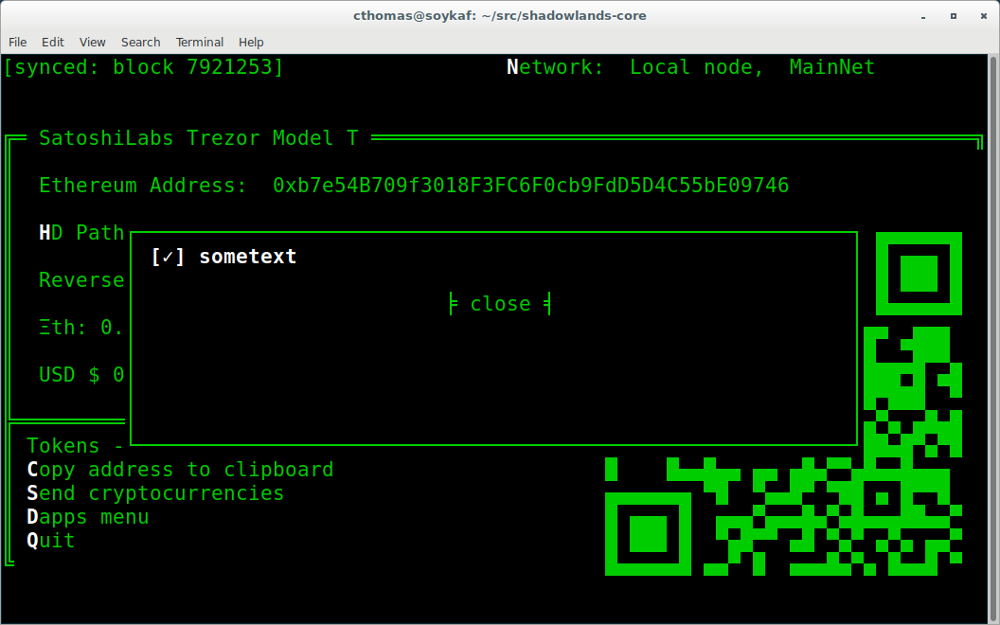

.. py:method:: SLFrame.add_qrcode(data)

Displays a QRCode from the data given.

.. code-block:: python
        :caption: Example

        class Dapp(SLDapp):
            def initialize(self):
                myframe = MyFrame(self, 20, 40)
                self.add_sl_frame(myframe)

        class MyFrame(SLFrame):
            def initialize(self):
                self.add_qrcode(self.dapp.node.credstick.address)
                self.add_button(self.close, "close")

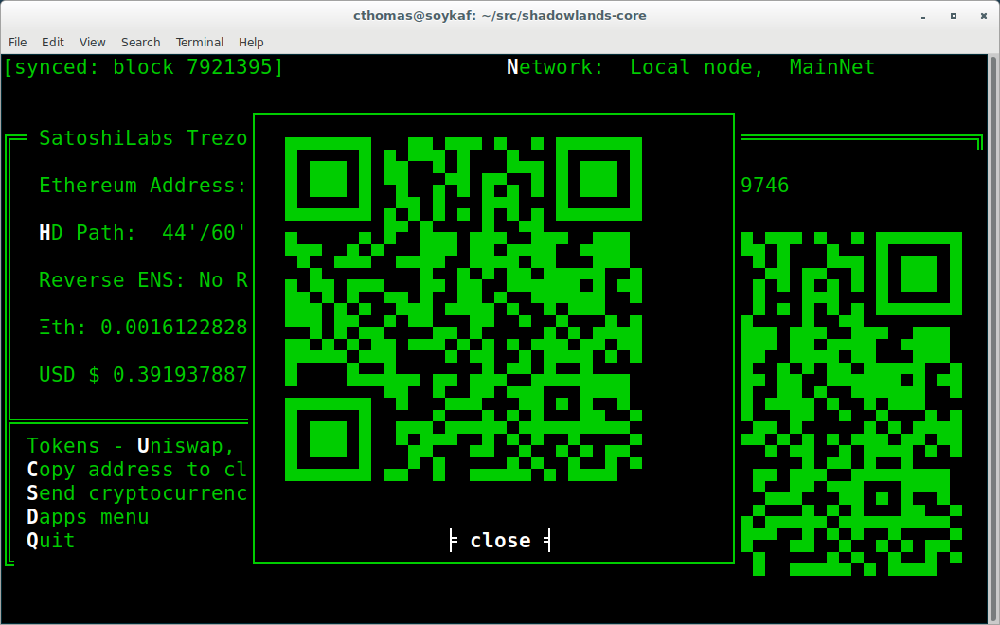

.. py:method:: SLFrame.add_textbox(label_text, default_value=None, add_divider=True, on_change=None, **kwargs):

Diplays a textbox for input. ``on_change`` takes a function that is run when the textbox changes value.

.. code-block:: python
        :caption: Example

        class MyFrame(SLFrame):
            def initialize(self):
                self.textbox_value = self.add_textbox("Value:", default_value="1000000")
                self.add_button_row([
                    ("show value", self.show_value,0),
                    ("close", self.close, 3)
                ])

            def show_value(self):
                self.dapp.add_message_dialog(str(
                    self.textbox_value()
                ))

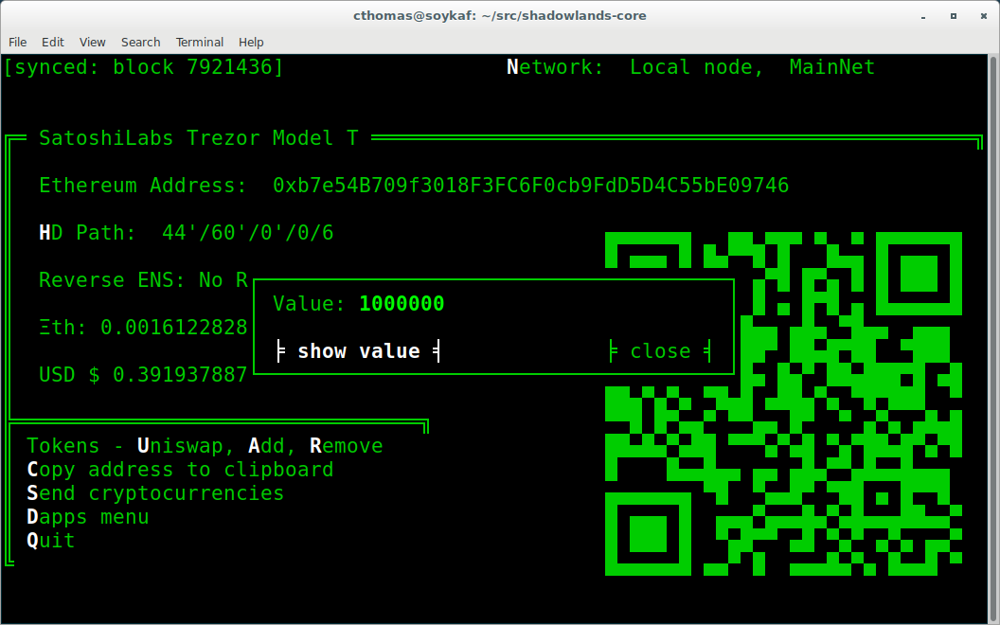

.. py:method:: SLFrame.add_divider(draw_line=False, **kwargs)

Add a horizontal spacer.  ``draw_line`` will cause a line to be drawn across the space.

.. py:method:: SLFrame.add_radiobuttons(options, default_value=None, layout=[100], layout_index=0, add_divider=True, on_change=None **kwargs)

Radiobuttons widget.  Returns a function which, when executed, gives the value chosen.  ``options`` is an array of tuples, filled with (label, value).  ``layout`` follows the layout rules described in AsciimaticsLayout_.  You can provide an optional ``on_change`` function.

.. code-block:: python
        :caption: Example

        class MyFrame(SLFrame):
            def initialize(self):
                options = [
                    ("Option one", 1),
                    ("Option two", 2),
                    ("Option three", 3)
                ]
                self.options_value = self.add_radiobuttons(
                    options,
                    default_value = 2,
                    on_change=self.useful_fn
                )
                self.add_button(self.close, "close")

            def useful_fn(self):
                self.dapp.add_message_dialog(self.options_value())

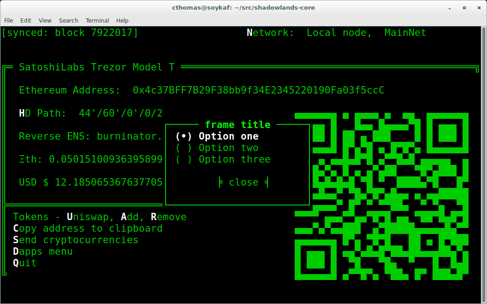

.. py:method:: SLFrame.add_listbox(options, default_value=None, on_select=None, layout=[100], layout_index=0, **kwargs)

Returns a function which, when executed, gives the value chosen.  ``options`` is an array of tuples, filled with (label, value).  ``layout`` follows the layout rules described in AsciimaticsLayout_.  You can provide an optional ``on_change`` function.

.. code-block:: python
        :caption: Example

        class Dapp(SLDapp):
            def initialize(self):
                myframe = MyFrame(self, 8, 25, title="frame title")
                self.add_sl_frame(myframe)

        class MyFrame(SLFrame):
            def initialize(self):
                options = [
                    ("Option one", 1),
                    ("Option two", 2),
                    ("Option three", 3)
                ]
                self.options_value = self.add_listbox(
                    options,
                    default_value = 2,
                    on_change=self.useful_fn
                )
                self.add_button(self.close, "close")

            def useful_fn(self):
                self.dapp.add_message_dialog(self.options_value())

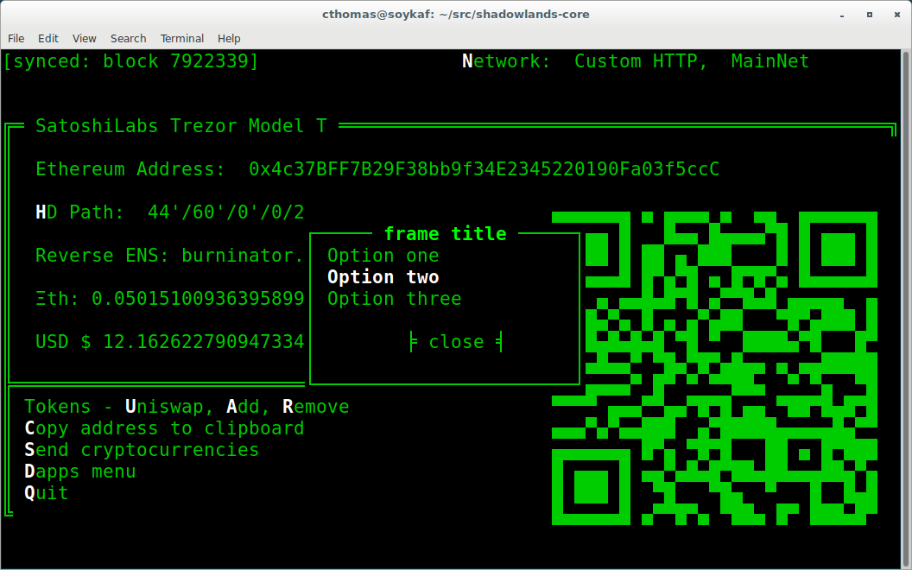

.. py:method:: SLFrame.add_label(label_text, layout=[100], layout_index=0, add_divider=True)

Display the string ``label_text``.``layout`` follows the layout rules described in AsciimaticsLayout_.

.. code-block:: python
        :caption: Example

        class Dapp(SLDapp):
            def initialize(self):
                myframe = MyFrame(self, 8, 60, title="frame title")
                self.add_sl_frame(myframe)

        class MyFrame(SLFrame):
            def initialize(self):
                self.add_label("HELLOOO")

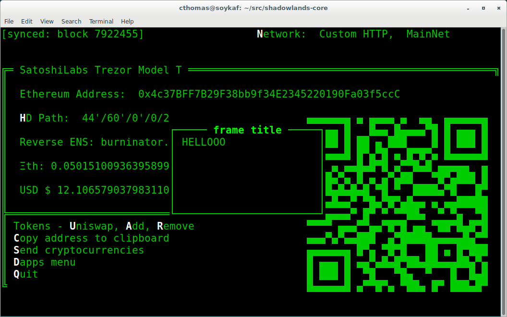

 
.. py:method:: SLFrame.add_label_row(self, labels, layout=[1, 1, 1, 1], add_divider=True)

Add multiple labels. ``labels`` is an array of tuples of format (string, index) where index is the layout index. ``layout`` follows the layout rules described in AsciimaticsLayout_.

.. code-block:: python
        :caption: Example

        class MyFrame(SLFrame):
            def initialize(self):
                labels = [
                    ("Hiiiii", 0),
                    ("Heeeeey", 2),
                    ("HELLOOO", 3)
                ]
                self.add_label_row(labels)

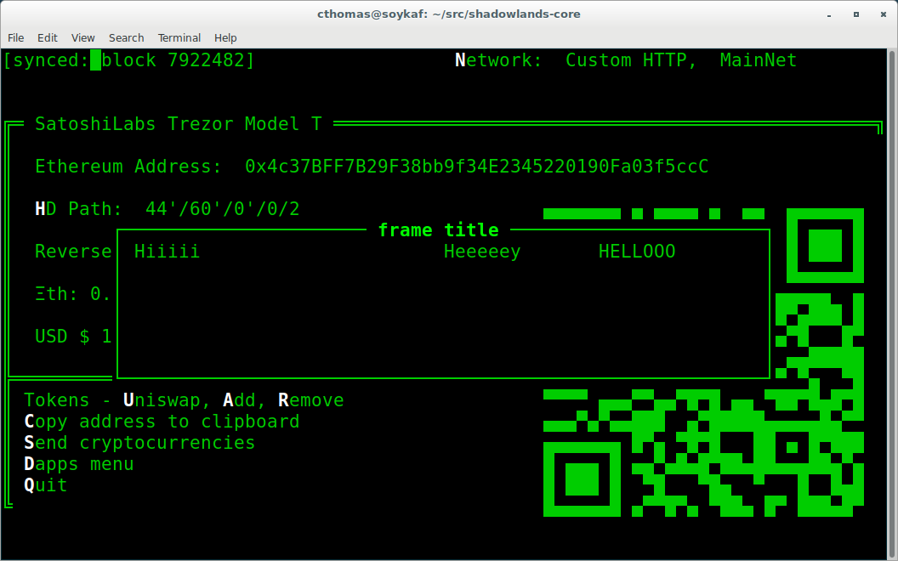

.. py:method:: SLFrame.add_label_with_button(label_text, button_text, button_fn, add_divider=True, layout=[70, 30])

A label on the left and button on the right.  ``button_fn`` will be executed upon button press.  ``layout`` follows the layout rules described in AsciimaticsLayout_.

.. code-block:: python
        :caption: Example

        class Dapp(SLDapp):
            def initialize(self):
                myframe = MyFrame(self, 20, 70, title="frame title")
                self.add_sl_frame(myframe)

        class MyFrame(SLFrame):
            def initialize(self):
                labels = [
                    ("Hiiiii", 0),
                    ("Heeeeey", 2),
                    ("HELLOOO", 3)
                ]
                self.add_label_row(labels)

.. py:method:: SLFrame.add_file_browser(path='/', height=15, on_change_fn=None)

Creates a file browser to select directories and files. 

Returns a function that returns the selected filepath.  

``path`` is the default filepath to start at.  ``height`` is an integer number
of how many files to display.  You can scroll through the rest.

``on_change_fn`` will fire whenever the filepath is changed.

.. code-block:: python
        :caption: Example

        class Dapp(SLDapp):
            def initialize(self):
                myframe = MyFrame(self, 20, 70, title="frame title")
                self.add_sl_frame(myframe)

        class MyFrame(SLFrame):
            def initialize(self):
                self.file_value = self.add_file_browser(path='/chaindata')
                self.add_button(self.useful_fn, "Select")

            def useful_fn(self):
                self.dapp.add_message_dialog(self.file_value())

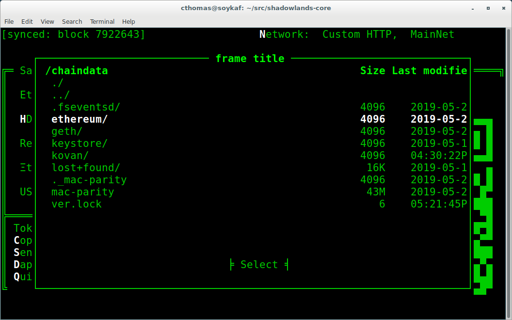

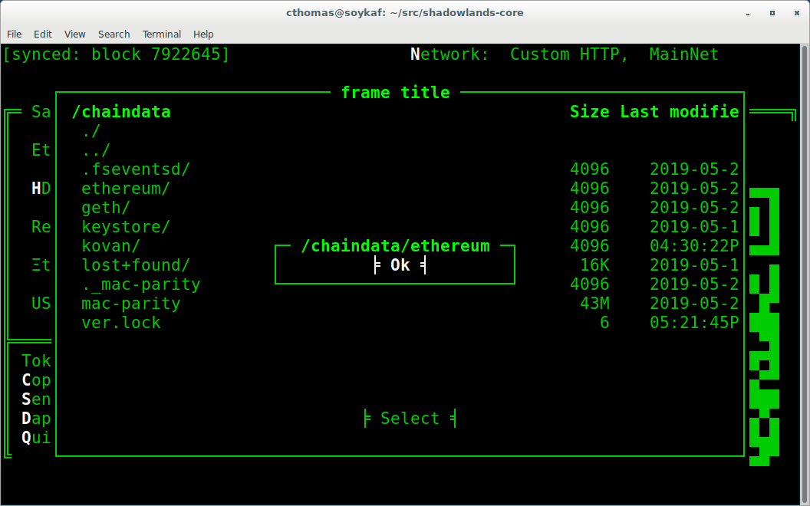

.. _AsciimaticsLayout: https://asciimatics.readthedocs.io/en/stable/widgets.html#displaying-your-ui
