Tutorial
=============

To start your own Dapp, open the dapps menu by pressing 'd' or 'D'  within the shadowlands application. 

.. highlight:: python
   :linenothreshold: 5

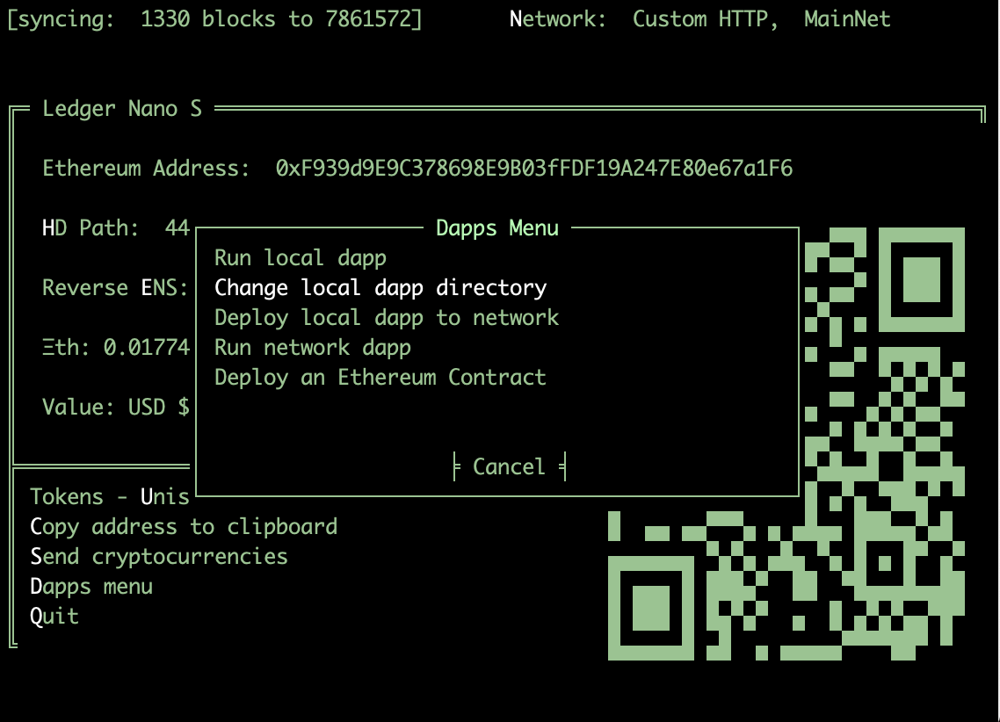

Next, set the local dapp directory to your desired location.

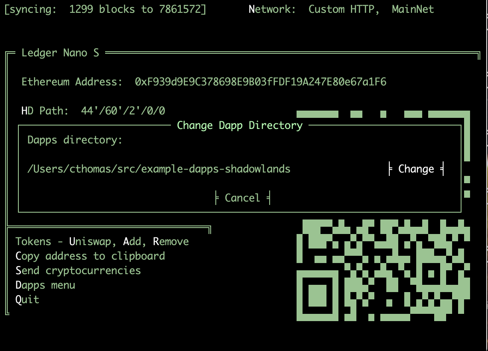

Inside your chosen local dapp directory, create a new subdirectory with the name of your dapp.  Inside, create a file called ``__init__.py``.

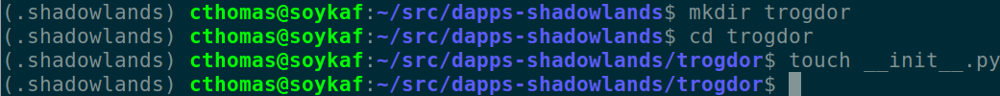

Your first SLDapp
-----------------

For our example, let's become Trogdor the Burninator, the wingaling dragon.  
We will burninate peasants in the kingdom of peasantry.  In our case, peasants will be BRNT (Burninator tokens) visible at token.burninator.eth)

Import :class:`SLDapp` at the top of your ``__init__.py`` file in your dapp's subdirectory. We'll also import :class:`SLFrame` and :class:`SLContract`.

    .. code-block:: python

        from shadowlands.sl_dapp import SLDapp
        from shadowlands.sl_frame import SLFrame
        from shadowlands.sl_contract import SLContract

Create a class named ``Dapp`` that subclasses :class:`SLDapp`.  The class must be named ``Dapp`` in 
order for the shadowlands plugin system to detect your dapp.  Override the 
:func:`SLDapp.initialize` method, and do any necessary preperation within.  Then, add an :class:`SLFrame` subclass (which you need to provide) with :func:`SLDapp.add_sl_frame`.  This step begins the user interface.

    .. code-block:: python

	from shadowlands.sl_dapp import SLDapp
	from shadowlands.sl_frame import SLFrame
	from shadowlands.sl_contract import SLContract

	class Dapp(SLDapp):
	    def initialize(self):
		# Define any variables that will be useful to you, such as contracts.
		# Any other setup steps go here

		# add a frame to begin the user interface
		self.add_sl_frame(MyMenuFrame(self, height=5, width=40, title="Trogdooooor!"))

	class MyMenuFrame(SLFrame):
	    def initialize(self):
		self.add_divider()
		self.add_button(self.close, "Close")

The line ``self.add_sl_frame(MyMenuFrame(self, height=5, width=40, title="Trogdooooor!"))``, referenced from ``initialize()``, will load an :class:`SLFrame` instance with the listed parameters when the dapp loads.

Like :class:`SLDapp` instances, :class:`SLFrame` instances execute ``initialize()`` when they are created, and you must implement this abstract method.  Our :class:`SLFrame` will add a one-line divider with ``self.add_divider()`` and then add a close button with ``self.add_button(self.close, "Close")``.  The first parameter to ``self.add_button`` is a function to be executed upon the button press action, in this case ``self.close()``.

Now, let's run our first dapp.  Open the dapps menu and choose to run a local dapp:

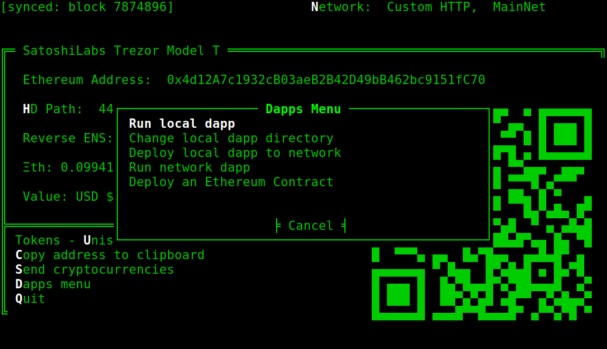

Now, choose your dapp from the list:

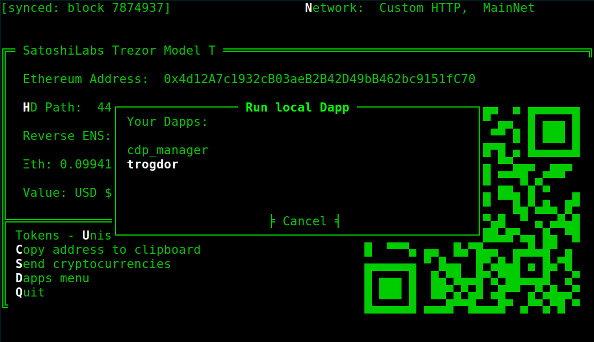

And this is the output:

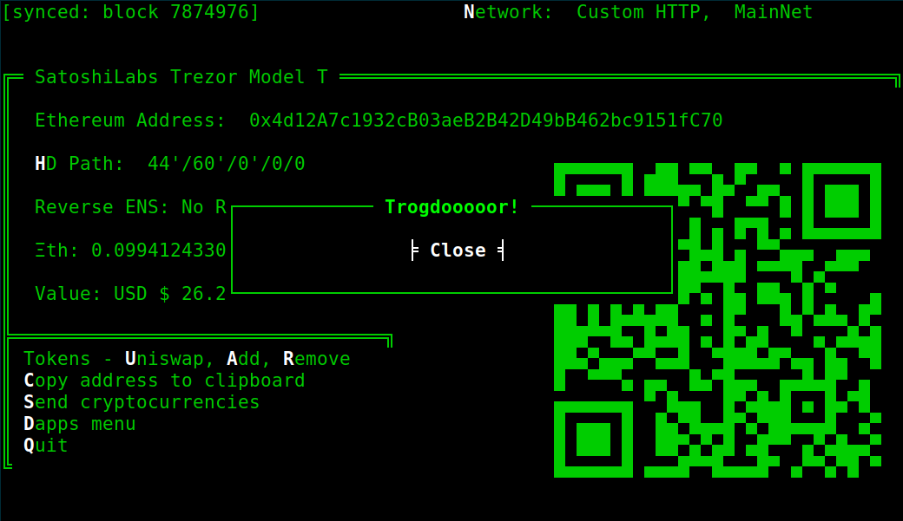

Debugging
---------

Now, let's make a few changes.  

.. code-block:: python

	from shadowlands.sl_dapp import SLDapp
	from shadowlands.sl_frame import SLFrame
	from shadowlands.sl_contract.erc20 import Erc20
	from shadowlands.tui.debug import debug, end_debug
	import pdb

	class Dapp(SLDapp):
	    def initialize(self):
		# Define any variables that will be useful to you, such as contracts.
		# Any other setup steps go here
		debug(); pdb.set_trace()

		PEASANT_ADDRESS = '0x8B654789353b0B622667F105eAEF9E97d3C33F44'
		peasant_contract = Erc20(self.node, address=PEASANT_ADDRESS)
		self.add_sl_frame(MyMenuFrame(self, height=5, width=40, title="Trogdooooor!"))

		# add a frame to begin the user interface

	class MyMenuFrame(SLFrame):
	    def initialize(self):
		self.add_divider()
		self.add_button(self.close, "Close")

Here you can see we've set up some debugging tools with a few import 
statements.  The functions debug() and end_debug() 
will give us a way to escape from the curses library that's controlling
the screen and let pdb work.

You can also see I defined ``PEASANT_ADDRESS`` which is the ethereum 
mainnet address of a simple ERC20 contract.  We load the contract with
the ``Erc20(self.node, address=PEASANT_ADDRESS)`` constuctor.  ``self.node`` is a reference to the ``Node`` object that the Dapp object has 
access to.

The important line ``debug(); pdb.set_trace()`` is something you should
become familiar with when writing a shadowlands app.  Running pdb without
escaping from the user interface will be a maddening experience, so don't forget to run ``debug()`` before you get pdb running.

Now, when you run your dapp, you'll see:

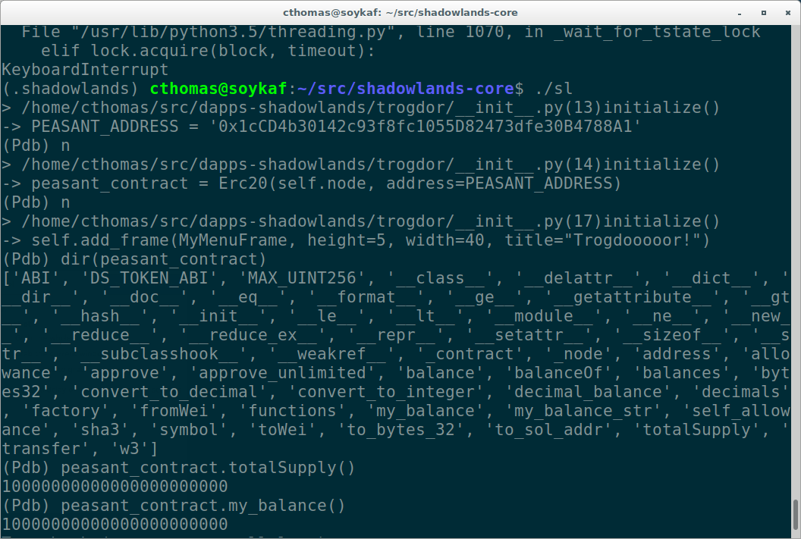

Here you can see some of the methods that the :class:`Erc20` class provides.  You can also access the underlying web3.py contract object by accessing ``peasant_contract._contract``.

To escape from the debug session and get back to your app, type ``end_debug();; continue``.  This incantation will restore control of the screen to the curses library and end the session.

Requirements File
-----------------

You can include a ``requirements.txt`` file in your dapp directory to import modules that you might need.
They will be installed into Shadowlands' python virtual environment at ``~/.shadowlands`` when the dapp runs 
on the host system.

There's no library dependancy in this tutorial, I just wanted to mention it.

Handling user input
-------------------

Let's get some user input and do something, er... useful?

.. code-block:: python

        from shadowlands.sl_dapp import SLDapp
        from shadowlands.sl_frame import SLFrame
        from shadowlands.sl_contract.erc20 import Erc20
        from decimal import Decimal
        from shadowlands.tui.debug import debug, end_debug
        import pdb

        class Dapp(SLDapp):
            def initialize(self):
                PEASANT_ADDRESS = '0x8B654789353b0B622667F105eAEF9E97d3C33F44'
                self.peasant_contract = Erc20(self.node, address=PEASANT_ADDRESS)
                self.peasants = self.peasant_contract.my_balance() / Decimal(10**18)
		self.add_sl_frame(MyMenuFrame(self, height=10, width=70, title="Trogdooooor!"))
                
        class MyMenuFrame(SLFrame):
            def initialize(self):
                self.add_label("Trogdor the wingaling dragon intends to burninate peasants.")
                self.add_label("Trogdor has {} peasants in need of burnination.".format(self.peasants_str))
                self.text_value = self.add_textbox("How many?")
                self.add_divider()
                self.add_button_row([
                    ("Burninate!", self.burninate, 0),
                    ("Close", self.close, 1)
                ])

            @property
            def peasants_str(self):
                return "{:f}".format(self.dapp.peasants)[:8]

            def burninate(self):
                try:
                    peasants_to_burninate = Decimal(self.text_value())
                except:
                    self.dapp.add_message_dialog("That number of peasants doesn't make sense.")
                    return

                if peasants_to_burninate > self.dapp.peasants:
                    self.dapp.add_message_dialog("You don't even *have* that many peasants!")
                    return
                elif peasants_to_burninate < 0.5:
                    self.dapp.add_message_dialog("This will not satisfy Trogdor.")
                    return

We've add some height and width to our :class:`SLFrame` on line 13, added labels and a textbox on lines 17 - 19, and traded in our simple button for ``add_button_row()`` on line 21.  All of the widgets available to display are documented on the :class:`SLFrame` page.

On line 12, we divide the number of peasantcoins by (10 ** 18) to account for the 18 decimal places of precision of this coin.

We're doing some simple input sanitization here, as well as some restrictions as to how many peasants can be burninated in one go.

Note that ``add_message_dialog()`` is a method belonging to Dapp, which is always accessible from an :class:`SLFrame` instance via ``self.dapp``.

So, let's see how we did.

Below we see the result of failing the input validation.

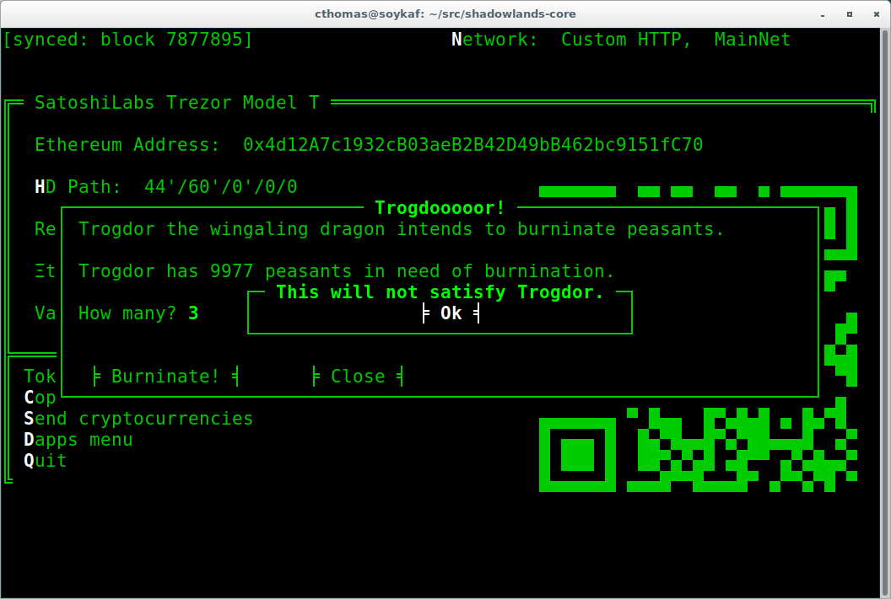

Transactions
------------

Let's get on to burninating some peasants.  

.. code-block:: python

        from shadowlands.sl_dapp import SLDapp
        from shadowlands.sl_frame import SLFrame
        from shadowlands.sl_contract.erc20 import Erc20
        from decimal import Decimal
        from shadowlands.tui.debug import debug, end_debug
        import pdb

        class Dapp(SLDapp):
            def initialize(self):
                PEASANT_ADDRESS = '0x8B654789353b0B622667F105eAEF9E97d3C33F44'
                self.peasant_contract = Erc20(self.node, address=PEASANT_ADDRESS)
                self.peasants = Decimal(self.peasant_contract.my_balance() / (10 ** 18))
                self.add_sl_frame(MyMenuFrame(self, height=10, width=70, title="Trogdooooor!"))

        class MyMenuFrame(SLFrame):
            def initialize(self):
                self.add_label("Trogdor the wingaling dragon intends to burninate peasants.")
                self.add_label("Trogdor has {} peasants in need of burnination.".format(self.peasants_str))
                self.text_value = self.add_textbox("How many?")
                self.add_divider()
                self.add_button_row([
                    ("Burninate!", self.burninate, 0),
                    ("Close", self.close, 1)
                ])

            @property
            def peasants_str(self):
                return "{:f}".format(self.dapp.peasants)[:8]

            def peasants_validated(self):
                try:
                    self.peasants_to_burninate = Decimal(self.text_value())
                except:
                    self.dapp.add_message_dialog("That number of peasants doesn't make sense.")
                    return False

                if self.peasants_to_burninate > self.dapp.peasants:
                    self.dapp.add_message_dialog("You don't even *have* that many peasants!")
                    return False
                elif self.peasants_to_burninate < 0.5:
                    self.dapp.add_message_dialog("This will not satisfy Trogdor.")
                    return False

                return True

            def burninate(self):
                if not self.peasants_validated():
                    return

                peasantcoins_to_burninate = self.peasants_to_burninate * Decimal(10 ** 18)

                burn_fn = self.dapp.peasant_contract.transfer(
                    '0x00000000000000000000000000000000DeaDBeef', 
                    int(peasantcoins_to_burninate)
                )

                self.dapp.add_transaction_dialog(
                    burn_fn, 
                    title="Trogdor burninates the peasantcoins", 
                    gas_limit=56000
                )

                self.close()

I've refactored our input validation to the method ``peasants_validated`` on line 30.

So, the time has come for the peasants to meet their final, fiery farewell at the nostrils of
the mighty Trogdor.

Note on line 56 that ``peasant_contract.transfer()`` returns a method, which we will feed 
into ``add_transaction_dialog()`` on line 61.

Let's see how this looks in practice.

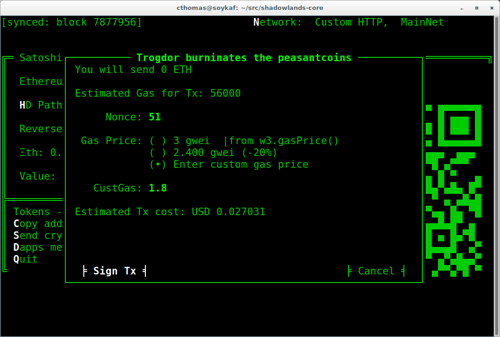

And so, we see there are a few less peasants in the kingdom of peasantry.

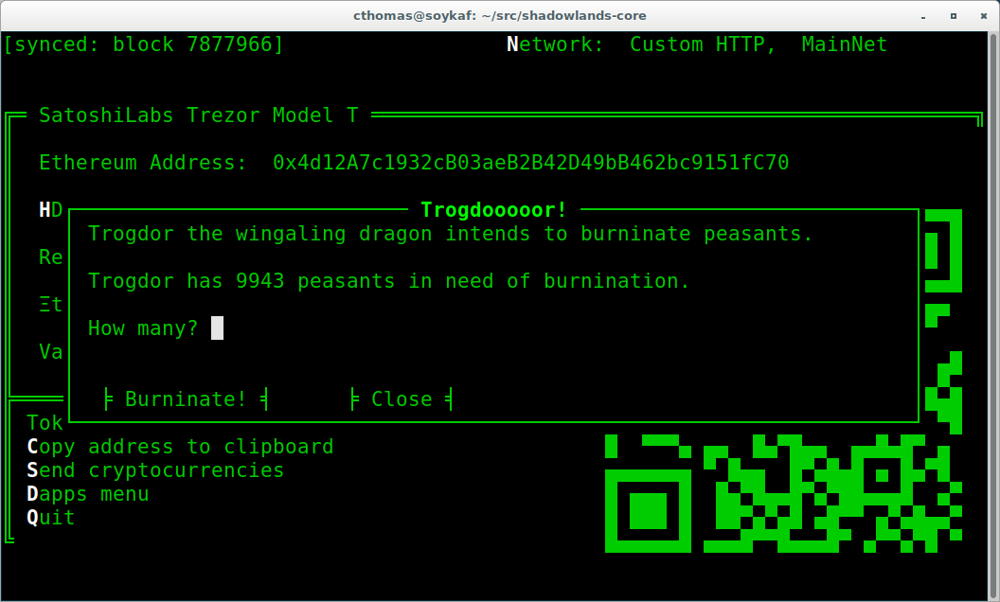

Subclassing :class:`Erc20` and :class:`SLContract <SLContract>`
----------------------------------------------------------------

Trogdor is distraught to discover that the peasants have not actually been burninated,
but only banished to the cave of 0xdeadbeef.  He demands true burnination.

Luckily, the PSNT contract supports burn(), although this is not a standard Erc20
function.  Let's subclass :class:`Erc20` and use some of the features of SLContract to make
our lives easier.

.. code-block:: python

	from shadowlands.sl_contract.erc20 import Erc20

	class PeasantCoin(Erc20):
	    MAINNET='0x8B654789353b0B622667F105eAEF9E97d3C33F44'
	    ABI='''
		[
			{
				"constant": true,
				"inputs": [],

		..(ABI truncated for brevity)...

		]
		'''

First we create a file called ``peasant_coin.py`` in our ``trogdor`` directory to house our subclass.

``PeasantCoin`` subclasses ``Erc20``.  The default ABI for the 
``Erc20`` subclass doesn't understand burn(), so we need to supply our own ABI.  

Subclassing ``SLContract`` (the superclass of ``Erc20``) works the same way - you can 
define MAINNET, KOVAN, and other network names that are defined by ``Node.NETWORK_DICT``, 
and set these to the deployment address of the contract.

We also can paste the ABI here. See the documentation for ``SLContract`` and ``Erc20`` to 
fully understand everything they provide.

.. code-block:: python

	from shadowlands.sl_dapp import SLDapp
	from shadowlands.sl_frame import SLFrame
	from trogdor.peasant_coin import PeasantCoin
	from decimal import Decimal
	from shadowlands.tui.debug import debug, end_debug
	import pdb

	class Dapp(SLDapp):
	    def initialize(self):
		self.peasant_contract = PeasantCoin(self.node)
		self.peasants = Decimal(self.peasant_contract.my_balance() / (10 ** 18))
		self.total_peasants =  Decimal(self.peasant_contract.totalSupply() / (10 ** 18))
		self.add_sl_frame(MyMenuFrame(self, height=12, width=70, title="Trogdooooor!"))

	class MyMenuFrame(SLFrame):
	    def initialize(self):
		self.add_label("Trogdor the wingaling dragon intends to burninate peasants.")
		self.add_label("There are {} peasants (PSNT) in the world.".format(
			self.peasant_decorator(self.dapp.total_peasants)
		))
		self.add_label("Trogdor has {} peasants in need of burnination.".format(
			self.peasant_decorator(self.dapp.peasants)
		))
		self.text_value = self.add_textbox("How many?")
		self.add_divider()
		self.add_button_row([
		    ("Burninate!", self.burninate, 0),
		    ("Close", self.close, 1)
		])

	    def peasant_decorator(self, peasants):
		return "{:f}".format(peasants)[:12]

We import ``PeasantCoin`` on line 3 and instantiate it on line 10.  We also grab the ``totalSupply()`` on line 12.  
Some refactoring into a decorator on line 31 makes things a little nicer.

.. code-block:: python

	def burninate(self):
   	    if not self.peasants_validated():
	        return

       	    peasantcoins_to_burninate = self.peasants_to_burninate * Decimal(10 ** 18)

	    burn_fn = self.dapp.peasant_contract.functions.burn(
	        int(peasantcoins_to_burninate)
	    )

	    self.dapp.add_transaction_dialog(
	        burn_fn, 
	        title="Trogdor burninates the peasantcoins", 
	        gas_limit=56000
	    )

	    self.close()

On line 7, we access the underlying function generated by web3.py with the ``functions()`` method.
Now when we burn PSNT tokens, they will be taken out of the ``totalSupply()``.

Uniswap Integration
-------------------

Uh-oh, Trogdor has run out of peasants to burninate.  What to do?

Shadowlands has native API integration with Uniswap, so let's add a button to acquire 
more PeasantCoin.

.. code-block:: python

	class MyMenuFrame(SLFrame):
	    def initialize(self):
		self.add_label("Trogdor the wingaling dragon intends to burninate peasants.")
		self.add_label("There are {} peasants (PSNT) in the world.".format(
		    self.peasant_decorator(self.dapp.total_peasants)
		))
		self.add_label("Trogdor has {} peasants.".format(
		    self.peasant_decorator(self.dapp.peasants)
		))
		self.text_value = self.add_textbox("How many?")
		self.add_divider()
		self.add_button_row([
		    ("Burninate!", self.burninate, 0),
		    ("Get More Peasants", self.get_peasants, 1),
		    ("Close", self.close, 2)
		], layout=[30, 40, 30]
		)

	    def get_peasants(self):
		self.dapp.add_uniswap_frame(self.dapp.peasant_contract.address)

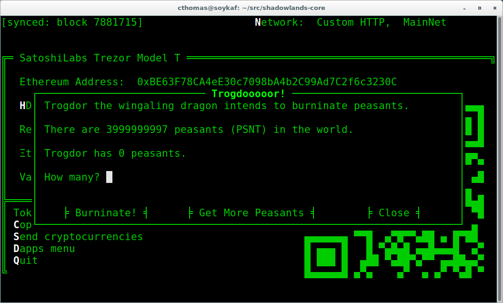

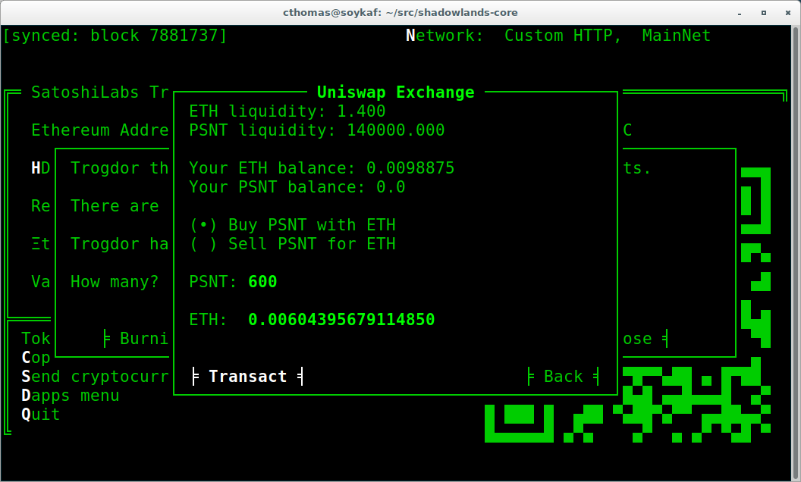

The Hall of Maximum Burnination
-------------------------------

What's the use of burninating peasants if nobody knows you did it?  Let's create
a leaderboard to show off our incindiary exploits.

There are a lot of additions here, but focus on lines 9 and 10, which checks for
the victory condition upon startup.

We define the VictoryFrame class on line 98.

.. code-block:: python

	class Dapp(SLDapp):
	    def initialize(self):
		self.token = PeasantCoin(self.node)
		self.peasants = Decimal(self.token.my_balance() / (10 ** 18))
		self.total_peasants =  self.token.totalSupply() / (10 ** 18)
		self.my_burninated_peasants = self.token.burninatedBy(self.node.credstick.address) / (10 ** 18)
		self.add_sl_frame(MyMenuFrame(self, height=24, width=74))

		if self.token.victorious():
		    self.add_sl_frame(VictoryFrame(self, height=9, width=62, title="Victory!!!"))

	class MyMenuFrame(SLFrame):
	    def initialize(self):
		self.add_label("The Hall Of Maximum Burnination", add_divider=False)
		self.add_divider(draw_line=True)
		self.add_label("Rank    Peasants           Hero", add_divider=False)

		for heroes in self.top_burninators_decorator():
		    self.add_label(heroes, add_divider=False)
		self.add_divider(draw_line=True)

		self.add_label("Trogdor the wingaling dragon intends to burninate peasants.", add_divider=False)
		self.add_label("There are {} peasants (BRNT) in the world.".format(self.peasant_decorator(self.dapp.total_peasants)))
		self.add_label("Trogdor has {} peasants, and has burninated {}".format(self.peasant_decorator(self.dapp.peasants), self.peasant_decorator(self.dapp.my_burninated_peasants)))
		self.text_value = self.add_textbox("How many to burninate?", default_value=' ')
		self.add_button_row([
		    ("Burninate!", self.burninate, 0),
		    ("Get More Peasants", self.get_peasants, 1),
		    ("Close", self.close, 2)
		], layout=[30, 40, 30]
		)

		
	    def top_burninators_decorator(self):
		burninators = self.dapp.token.top_burninators()
		i = 0 
		heroes = []

		#debug(); pdb.set_trace()
		for hero in burninators:
		    hero_name = self.dapp.node._ns.name(hero[0])
		    if hero_name is None:
			hero_name = hero[0]
		    heroes.append("{}       {:14s}     {}".format(i, self.peasant_decorator(hero[1]), hero_name))
		    i += 1 

		if len(heroes) < 10:
		    for x in range(len(heroes), 10):
			heroes.append(
			    "{}       Unclaimed".format(str(x)))

		return heroes

	    def peasant_decorator(self, peasants):
		return "{:f}".format(peasants)[:14]

	    def get_peasants(self):
		self.dapp.add_uniswap_frame(self.dapp.token.address)

	    def peasants_validated(self):
		try:
		    self.peasants_to_burninate = Decimal(self.text_value())
		except:
		    self.dapp.add_message_dialog("That number of peasants doesn't make sense.")
		    return False

		if self.peasants_to_burninate > self.dapp.peasants:
		    self.dapp.add_message_dialog("You don't even *have* that many peasants!")
		    return False
		elif self.peasants_to_burninate < 0.5:
		    self.dapp.add_message_dialog("This will not satisfy Trogdor.")
		    return False

		return True

	    def burninate(self):
		if not self.peasants_validated():
		    return

		tokens_to_burninate = self.peasants_to_burninate * Decimal(10 ** 18)

		burn_fn = self.dapp.token.burninate(
		    int(tokens_to_burninate)
		)

		self.dapp.add_transaction_dialog(
		    burn_fn, 
		    title="Trogdor burninates the tokens", 
		    gas_limit=56000
		)

		self.close()

	class VictoryFrame(SLFrame):
	    def initialize(self):
		self.add_label("Congratulations!  You have racked up a truly impressive", add_divider=False)
		self.add_label("count of {} burninated peasants, as well".format(self.peasant_decorator(self.dapp.my_burninated_peasants)), add_divider=False)
		self.add_label("as several incinerated thatched roof cottages and various", add_divider=False)
		self.add_label("counts of petty theft and vandalism.  Your throne in the", add_divider=False)
		self.add_label("Hall of Maximum Burnination awaits your Dragonly Personage!")
		self.add_button_row(
		    [("Claim Victoriousness", self.claim_victory, 0),
		    ("Back", self.close, 1)],
		    layout=[50, 50],
		)

	    def claim_victory(self):
		self.dapp.add_transaction_dialog(
		    self.dapp.token.claimVictory(), 
		    title="Claiming victory", 
		    gas_limit=100000
		)
		self.close()

	    def peasant_decorator(self, peasants):
		return "{:f}".format(peasants)[:14]

******************************************
A closer look at the peasantcoin contract
******************************************

The :class:`Erc20` class and its SLContract base class give you a great deal of
functionality for free, but it's often useful to add on some extra 
methods that have close connection to our contract calls.

The ``self.functions()`` is an easy way to get at the underlying 
function of the web3.py contract class.

:class:`Erc20` subclasses also provide passthrough methods to all standard
erc20 functions, as well as helper methods like ``my_balance()``

.. code-block:: python

	from shadowlands.sl_contract.erc20 import Erc20
	from shadowlands.tui.debug import debug, end_debug
	from decimal import Decimal
	import pdb

	class PeasantCoin(Erc20):

	    ### Passthrough calls to contract
	 
	    # Similar to balanceOf, but keeps track of burninated peasants
	    def burninatedBy(self, address):
		return self.functions.burninatedBy(address).call()

	    def topBurninators(self):
		return self.functions.topBurninators().call()
	 

	    ### Helper methods

	    def my_burninated_peasants(self):
		return self.burninatedBy(self.node.credstick.address)

	  
	    def top_burninators(self): 
		''' 
		Returns a sorted list of lists of integers and addresses, 
		representing the top burninators. Maximum 10 results.
		'''
		burninators = set(self.topBurninators())
		burninators.remove('0x0000000000000000000000000000000000000000')
		if len(burninators) == 0:
		    return []

		burninators = [[x, Decimal(self.burninatedBy(x)) / (10 ** 18)] for x in list(burninators)]
		burninators.sort(key=lambda x: x[1], reverse=True)
		return burninators

	    def victorious(self):
		'''
		Returns True or False.
		True only if user is not currently in the hall but is
		allowed to take a spot.
		'''
		if self.my_burninated_peasants() == 0:
		    return False

		# Are we already in the hall of max burnination?
		if self.node.credstick.address in [self.topBurninators()]:
		    return False

		if len(top) < 10:
		    return True

		# Weakest burninator first
		top = self.top_burninators()
		top.sort(key=lambda x: x[1])

		if top[0][1] < Decimal(self.my_burninated_peasants()) / 10 ** 18:
		    return True
		return False

	    ### TXs
	    def burninate(self, peasants):
		return self.functions.burn(peasants)

	    def claimVictory(self):
		return self.functions.claimVictory()

	    ABI='''
	    [{"name":"Transfer","inputs":[{"type":"addre...  
	    '''

Here is the hall of Maximum Burnination, in all its glory:

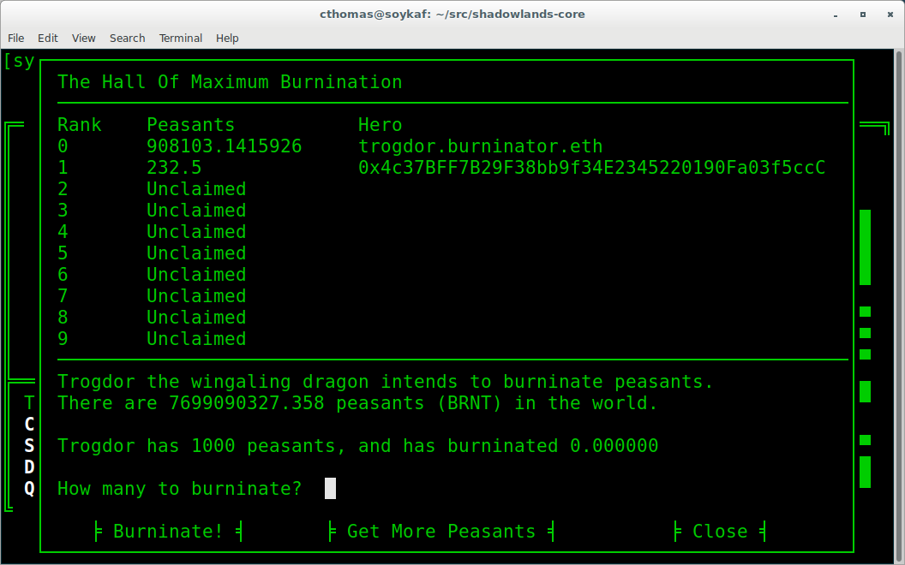

And so, 133 fiery peasants later (and after restarting the dapp)...

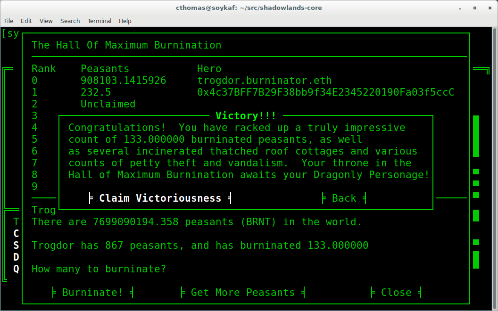

And so, after the transaction is run and we restart the app...

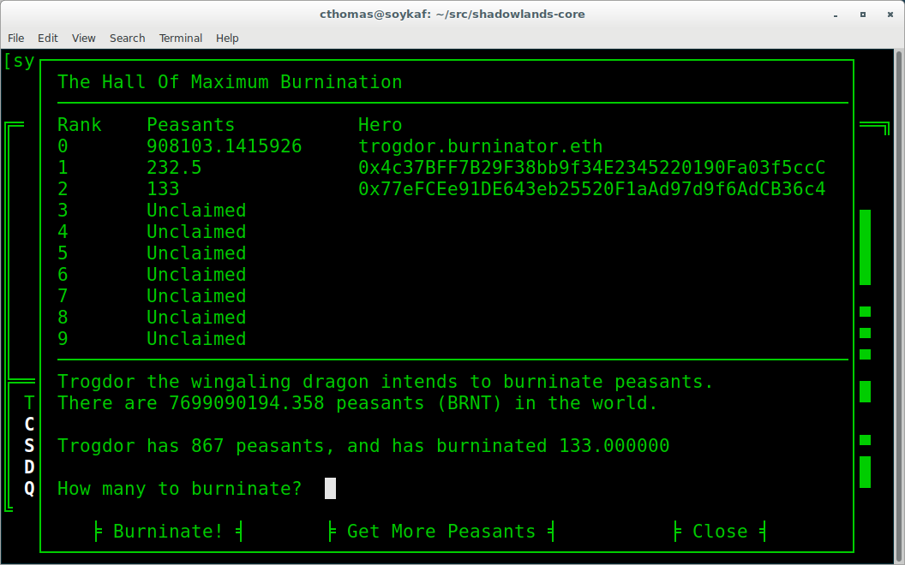

Huzzah!  We are immortal - for the time being.

Making your dapp update dynamically
------------------------------------

It's hella lame that we have to keep restarting the app in
order to react to changes on the blockchain.  Luckily, 
help is on the way.

The label widgets on shadowlands can take either a string, or a 
function reference (or lambda) that returns a string. That 
will let us make the displays dynamic, but it also can make 
your dapp VERY SLOW.

To help solve this performance problem, the :class:`SLDapp` and :class:`SLFrame` classes 
will automatically expire the cache on any ``@cached_property`` 
when a new block appears.

Using lambdas to cached properties as input to labels combines the 
best of both worlds - any function reference you pass to a label 
will be both dynamic and reasonably performant.

In addition, :class:`SLDapp` and :class:`SLFrame` will both trigger the ``new_block_callback()``
which you can override for your own purposes.  This callback will be called
immediately after the cached properties are expired, 

Let's put our informational display strings in cached properties to let 
the app update dynamically.  We can also implement ``new_block_callback()``
to make the victory frame pop up when appropriate.

.. code-block:: python

	from shadowlands.sl_dapp import SLDapp
	from shadowlands.sl_frame import SLFrame
	from burninator.peasant_coin import PeasantCoin
	from decimal import Decimal
	from cached_property import cached_property
	from shadowlands.tui.debug import debug, end_debug
	import pdb

	class Dapp(SLDapp):
	    def initialize(self):
		self.token = PeasantCoin(self.node)
		self.add_sl_frame(MyMenuFrame(self, height=24, width=74 ))

		self.victory_notification_has_been_seen = False
		self.victory_check()

	    def victorious_check(self):
		if self.victory_notification_has_been_seen:
		    return

		if self.token.victorious():
		    self.add_sl_frame(VictoryFrame(self, height=9, width=62, title="Victory!!!"))
		    self.victory_notification_has_been_seen = True

	    def new_block_callback(self):
		self.victory_check()

	    @cached_property
	    def total_peasants(self):
		return self.token.totalSupply() / (10 ** 18)

	    @cached_property
	    def my_burninated_peasants(self):
		return self.token.burninatedBy(self.node.credstick.address) / (10 ** 18)

	    @cached_property
	    def peasants(self):
		return Decimal(self.token.my_balance() / (10 ** 18))

	    def peasant_decorator(self, peasants):
		return "{:f}".format(peasants)[:14]

Here we implement ``new_block_callback()`` and use it to call ``victory_check()``.  It may be 
useful to know that ``new_block_callback()`` is called immediately after the cache is expired.

On line 5  we import the ``cached_property`` decorator.

We declare most of the dapp variables as ``@cached_property`` now - this will let them update 
dynamically, as well as keeping performant when any other classes in the dapp need to reference them.

.. code-block:: python

	class MyMenuFrame(SLFrame):
	    def initialize(self):
		self.add_label("The Hall Of Maximum Burnination", add_divider=False)
		self.add_divider(draw_line=True)
		self.add_label("Rank    Peasants           Hero", add_divider=False)

		for i in range(10):
		    self.add_label(self.burninator_hero(i), add_divider=False)
		self.add_divider(draw_line=True)

		self.add_label("Trogdor the wingaling dragon intends to burninate peasants.", add_divider=False)
		self.add_label(lambda: self.total_peasants_string)
		self.add_label(lambda: self.my_peasant_status_string)
		self.text_value = self.add_textbox("How many to burninate?", default_value=' ')
		self.add_button_row([
		    ("Burninate!", self.burninate, 0),
		    ("Get More Peasants", self.get_peasants, 1),
		    ("Close", self.close, 2)
		], layout=[30, 40, 30]
		)

	    @cached_property
	    def total_peasants_string(self):
		return "There are {} peasants (BRNT) in the world.".format(self.dapp.peasant_decorator(self.dapp.total_peasants))

	    @cached_property
	    def my_peasant_status_string(self):
		return "Trogdor has {} peasants, and has burninated {}".format(self.dapp.peasant_decorator(self.dapp.peasants), self.dapp.peasant_decorator(self.dapp.my_burninated_peasants))

	    def burninator_hero(self, index):
		return lambda: self.top_burninators_decorator[index]

	    @cached_property
	    def top_burninators_decorator(self):
		burninators = self.dapp.token.top_burninators()
		i = 0 
		heroes = []

		for hero in burninators:
		    hero_name = self.dapp.node._ns.name(hero[0])
		    if hero_name is None:
			hero_name = hero[0]
		    heroes.append("{}       {:14s}     {}".format(i, self.dapp.peasant_decorator(hero[1]), hero_name))
		    i += 1 

		if len(heroes) < 10:
		    for x in range(len(heroes), 10):
			heroes.append(
			    "{}       Unclaimed".format(str(x)))

		return heroes

The magic happens on lines 12 and 13, where we send a ``lambda: self.property_name`` into the labels.
I had to get a little bit fancy at line 8 and call a function to return
lambdas that index the array returned by the cached property ``top_burninators_decorator``.

And now our app updates live.

Tutorial Source Code
--------------------

The source code for the Burninator app is available on github at https://github.com/kayagoban/burninator

Deploying your dapp
-------------------

Shadowlands has a package management contract that allows you to deploy your dapp
so you can share it with the world.

Once registered, anyone can run your dapp by using the ethereum address
you used to register the software (they can also reference your ENS, which is much nicer).

It sounds complicated, but it's quite easy.

Select the ``Deploy local dapp to network`` from the Dapps menu.

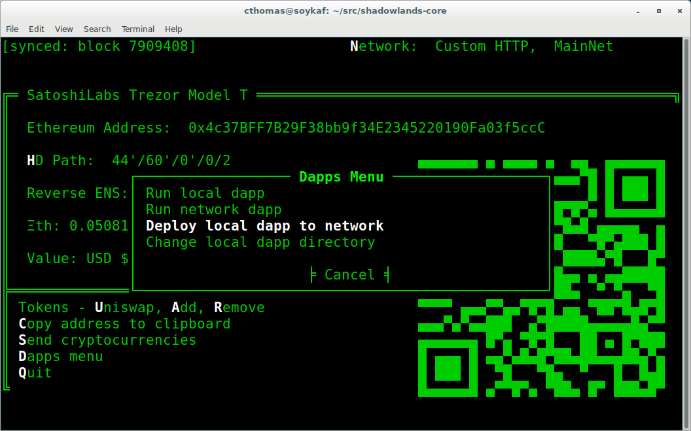

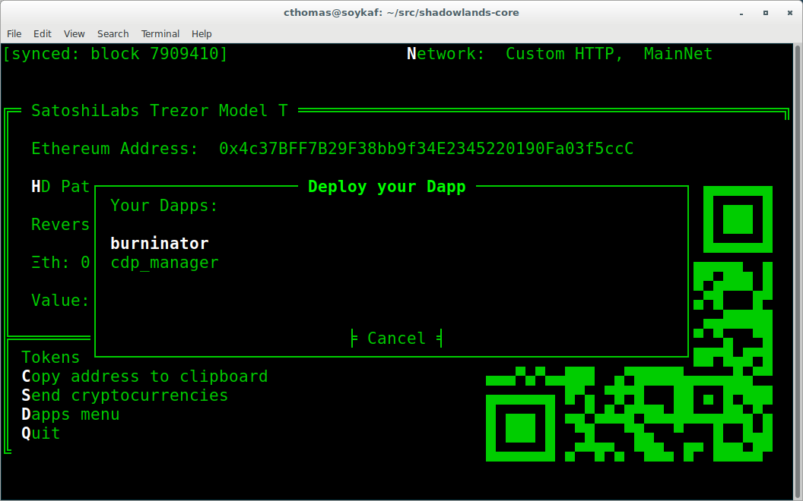

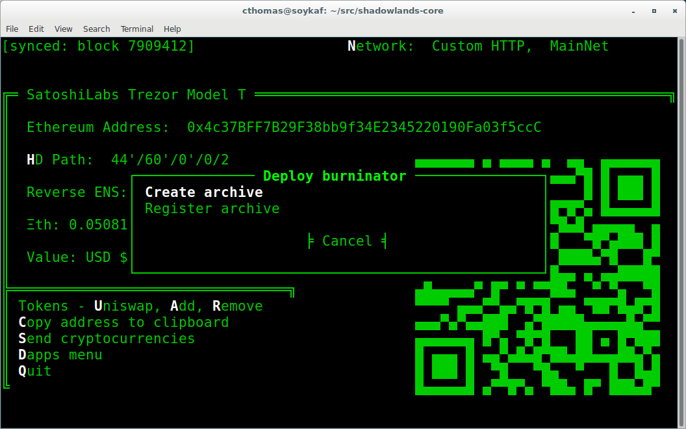

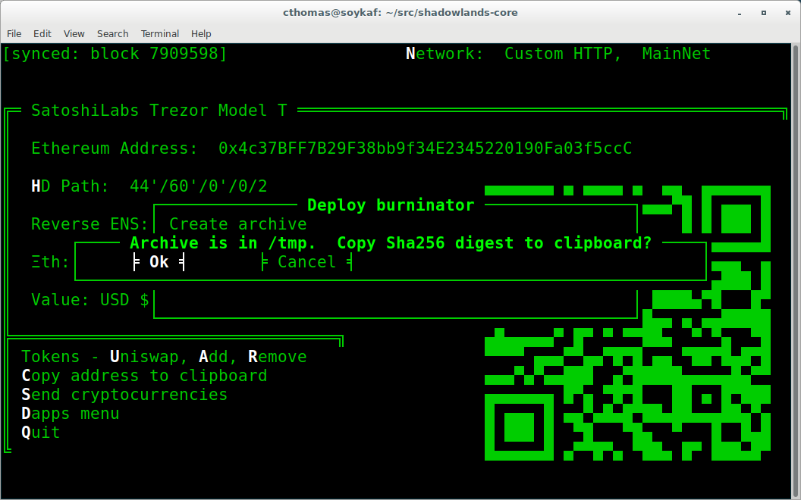

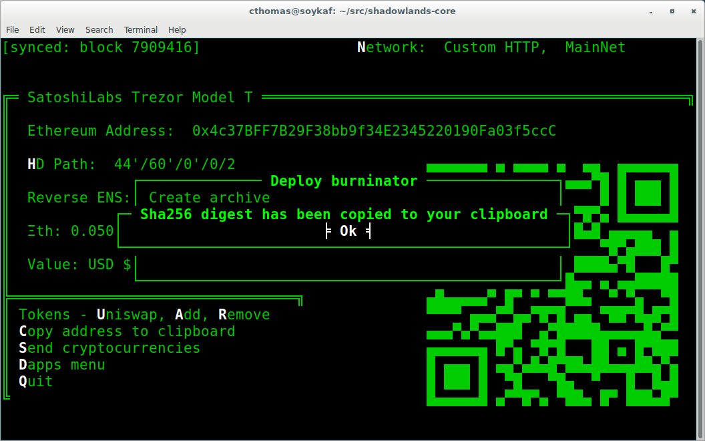

Now, copy the zip file to some place on the internet. 

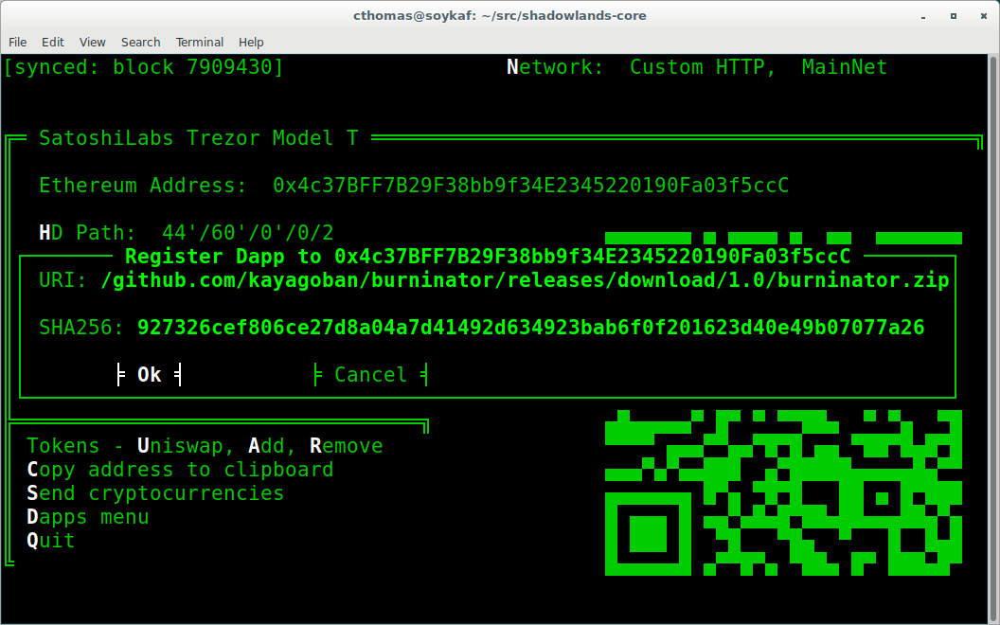

Now you will register this URL and checksum with the contract at sloader.shadowlands.eth - Once the TX is mined, anyone can run your app:

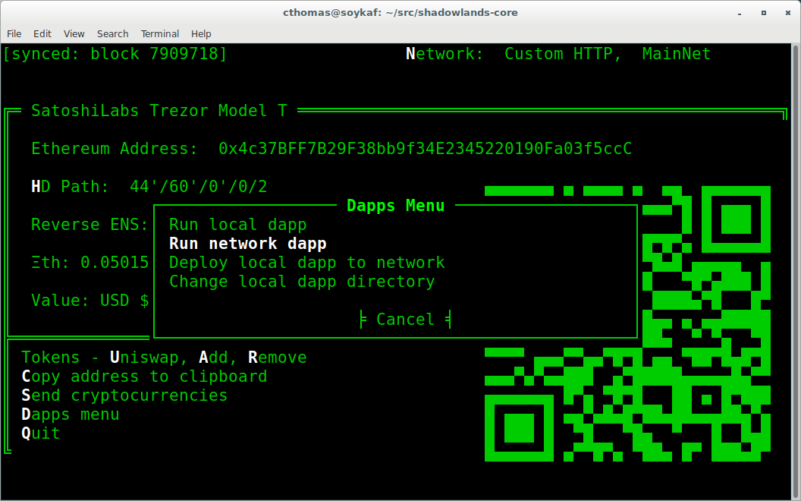

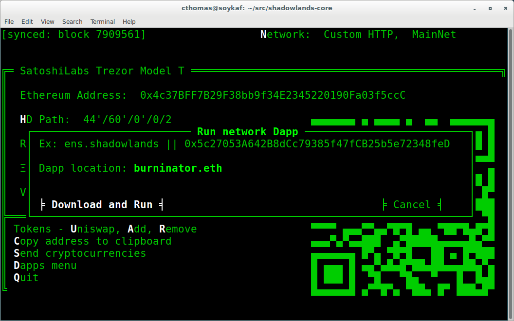

And there we are!

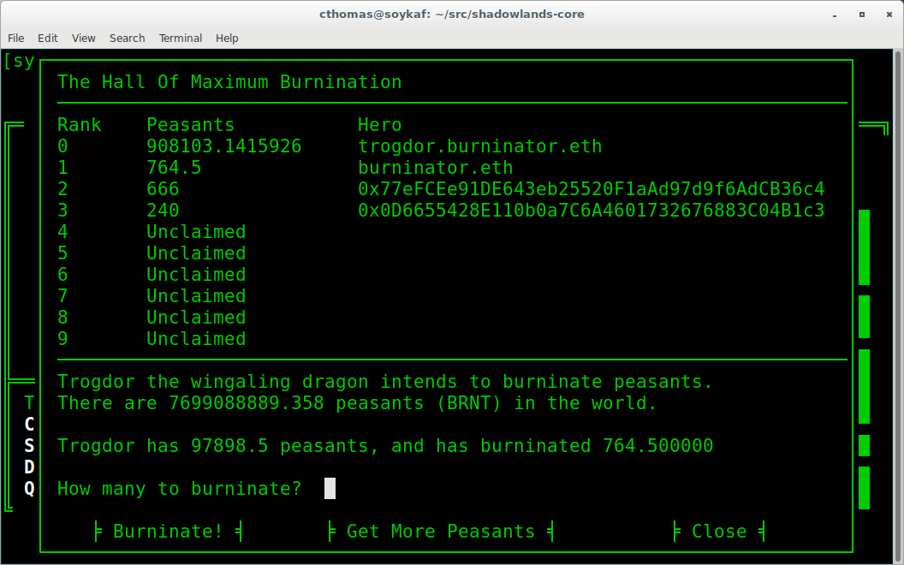

Disclaimer
----------

No peasants were harmed during the writing of this tutorial.

